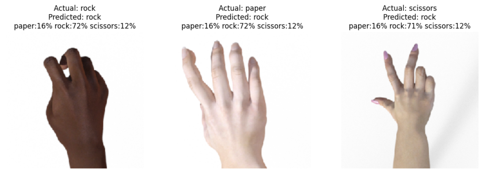

# 🤖 Real-Time Hand Gesture Recognition System
### Built with Deep Learning & Transfer Learning (MobileNetV2)



> A deep learning-powered Rock Paper Scissors game that uses your webcam to detect hand gestures in real-time. Built using MobileNetV2 Transfer Learning with TensorFlow — achieving 95%+ validation accuracy across 3 gesture classes.


---

## 📌 Overview

This project is a real-time hand gesture recognition system built using computer vision and deep learning. It captures live webcam input, classifies the hand gesture as **Rock**, **Paper**, or **Scissors**, and plays a game against the computer — all in real-time inside Google Colab.

The model uses **MobileNetV2** as a pretrained base (ImageNet weights) with a custom classification head, achieving **95%+ validation accuracy** on the dataset.

---

## 🎯 Features

- 🎥 Real-time webcam capture via WebRTC in Google Colab
- 🧠 Transfer learning with MobileNetV2 for high accuracy
- 📊 Live confidence bar chart for all 3 gesture classes
- 🎮 Full Rock Paper Scissors game with score tracking
- 📈 Training accuracy & loss visualization

---

## 🛠️ Tech Stack

| Category | Technology |
|---|---|
| Language | Python 3 |
| Deep Learning | TensorFlow / Keras |
| Pretrained Model | MobileNetV2 (ImageNet) |
| Image Processing | OpenCV, PIL (Pillow) |
| Data Handling | NumPy |
| Visualization | Matplotlib |
| Webcam Integration | JavaScript (WebRTC) |
| Environment | Google Colab |
| Dataset | KaggleHub |

---


## 📦 Dataset

- **Source:** [Kaggle — Rock Paper Scissors Dataset](https://www.kaggle.com/datasets/sanikamal/rock-paper-scissors-dataset)
- **Classes:** Rock, Paper, Scissors
- **Train set:** 2,520 images
- **Test set:** 372 images
- **Image size:** 224 × 224 px

---

## 🧠 Model Architecture

```
Input (224x224x3)
    │
    ▼
Data Augmentation
(RandomFlip, RandomRotation, RandomZoom, RandomBrightness, RandomContrast)
    │
    ▼
MobileNetV2 (frozen, ImageNet weights)
    │
    ▼
GlobalAveragePooling2D
    │
    ▼
Dropout (0.3)
    │
    ▼
Dense (3, softmax)  →  [paper, rock, scissors]
```

---

## 📊 Results

| Metric | Score |
|---|---|
| Training Accuracy | ~99% |
| Validation Accuracy | ~95%+ |
| Test Classes | 3 (Rock, Paper, Scissors) |
| Epochs | 10 |
| Optimizer | Adam (lr=0.001) |
| Loss Function | Sparse Categorical Crossentropy |

---

## 🚀 Getting Started

### 1. Open in Google Colab
[Google Colab](https://colab.research.google.com/drive/1qhmoKmPKTotoez10Pque9Hp9Scid_v4y)

### 2. Install dependencies
```python
import kagglehub
import tensorflow as tf
import cv2
import numpy as np
from PIL import Image
```

### 3. Download dataset
```python
import kagglehub
path = kagglehub.dataset_download("sanikamal/rock-paper-scissors-dataset")
```

### 4. Train the model
Run all cells in order from Cell 1 through Cell 7.

### 5. Play the game
```python
capture_and_predict()  # shows webcam, captures hand, predicts & plays
```

---

## 🎮 How to Play

1. Run the setup cells (Cell 1–7) to train and save the model
2. Run the game cell and **allow camera access** when prompted
3. Show your hand — **Rock ✊, Paper ✋, or Scissors ✌️**
4. The AI detects your gesture and the computer picks randomly
5. See the result and your running score!

---

## ⚠️ Known Limitations

- Works best with a **plain/neutral background**
- Performance may vary with **low lighting**
- Webcam access requires **Google Chrome** on HTTPS
- Model trained on synthetic dataset — real hands may vary slightly

## 👤 Author

**A girl named Akisha**

---

## 🙏 Acknowledgements

- [Sanikamal](https://www.kaggle.com/sanikamal) for the Kaggle dataset
- [Google](https://colab.research.google.com) for the Colab environment
- [TensorFlow Team](https://tensorflow.org) for MobileNetV2
